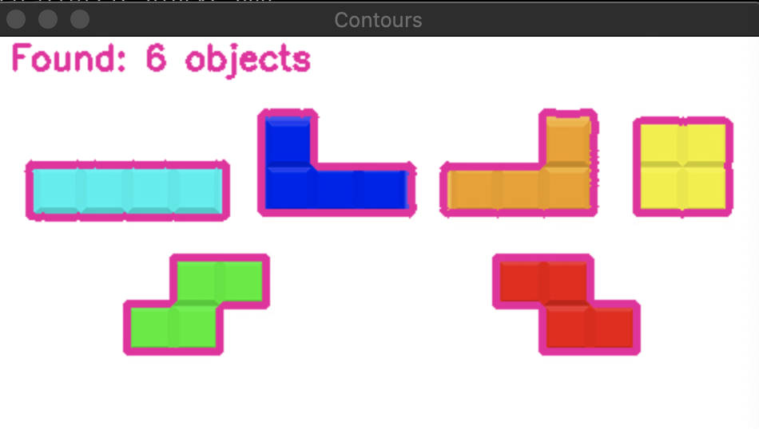
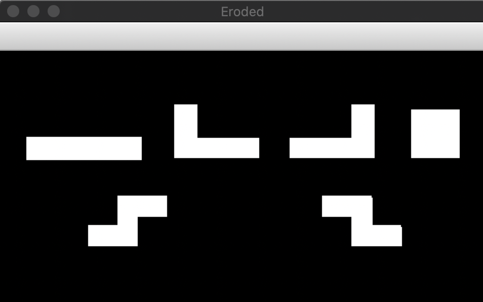
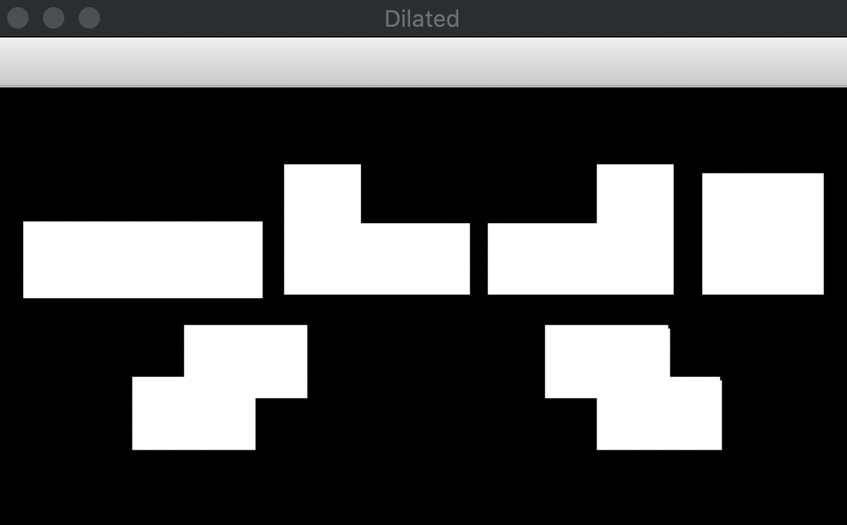
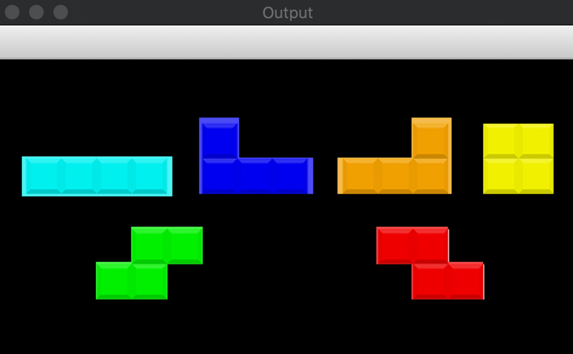

# Подсчет количества фигур из тетриса

[Go](https://github.com/Ailme/opencv_example/blob/tetris-blocks/go/)

[Python](https://github.com/Ailme/opencv_example/blob/tetris-blocks/python/) 

</img>
</img>
</img>
</img>
</img>
</img>
</img>
</img>

### Полезные материалы

https://github.com/Ailme/opencv_example/blob/master/README.md