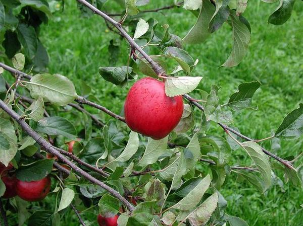
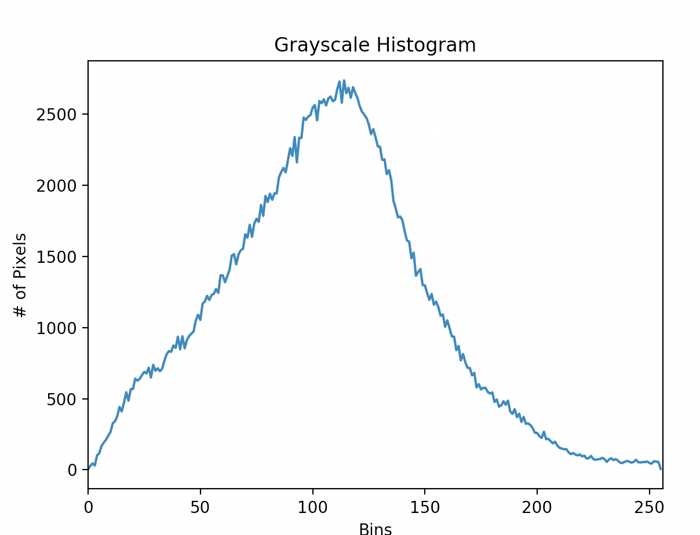
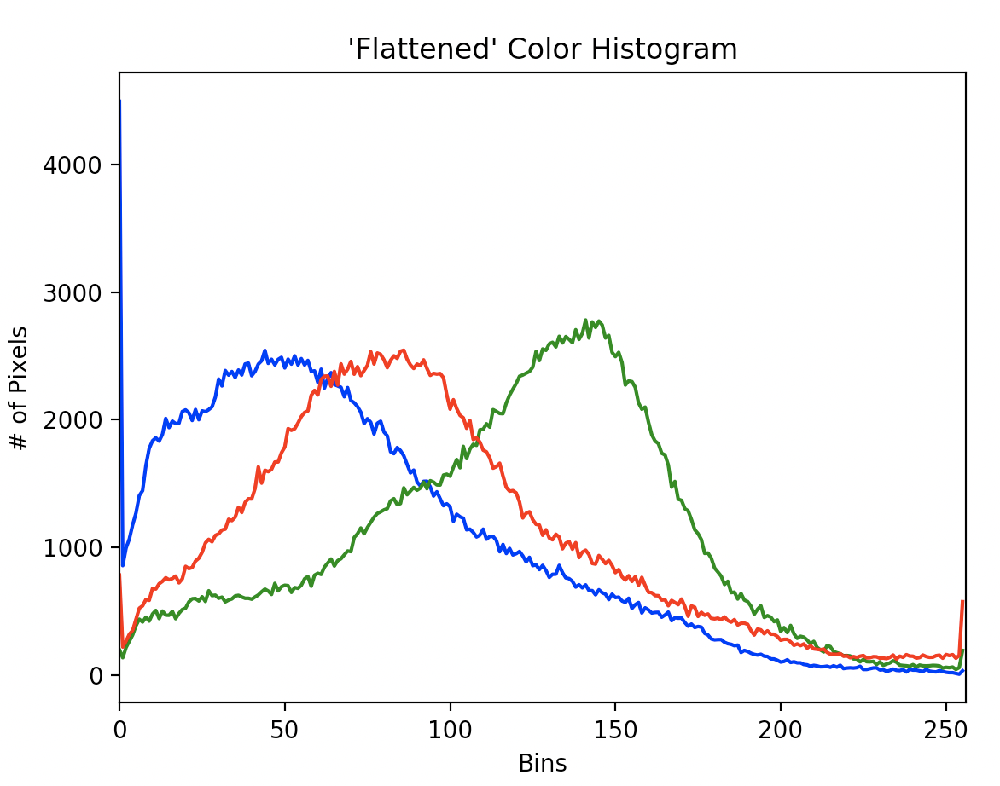
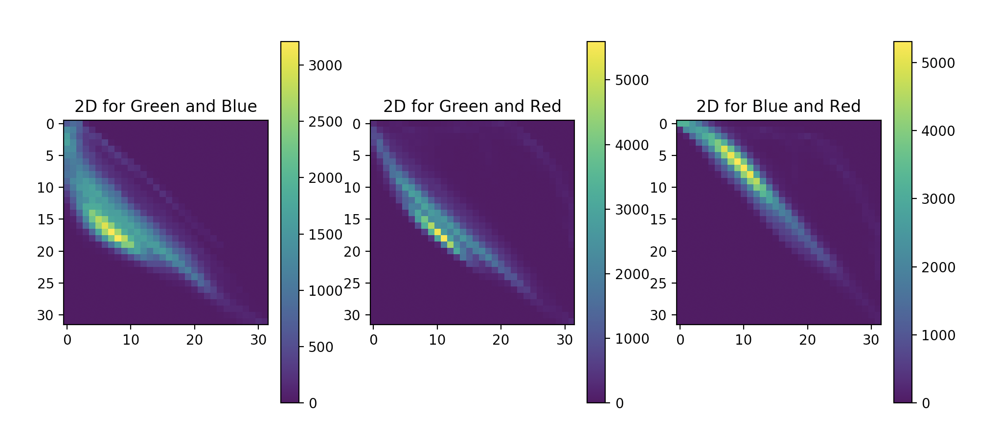

# Compute Histograms

[Python](https://github.com/Ailme/opencv_example/blob/compute-histograms/python/README.md) 

### Полезные материалы

https://github.com/Ailme/opencv_example/blob/master/README.md